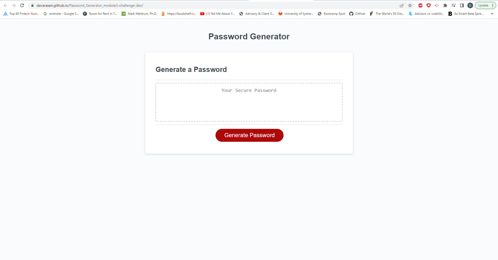

# <module3-challenge-dev>

## Description

This website showcases a password generator which will generate a password based on a selection of criteria.

These criterias are:
<<<<<<< HEAD
    - character length will be selected by user limited between 8 - 128 characters.
    - whether to include lowercase, uppercase, numerical or special characters.
=======
- character length will be selected by user limited between 8 - 128 characters.
- whether to include lowercase, uppercase, numerical or special characters.
>>>>>>> 5f07a93f04c58feb656c283cffe5b5caad4de009

URL: https://devarasen.github.io/Password_Generator_module3-challenge-dev/

## Usage

Follow steps:

    1. Click red "Generate Password" button to begin.
    2. Select number between 8 - 128 characters for password length.
    3. Follow prompts and proceed as preferred.
    4. Window alert will return generated password
    5. Once alert is closed, generated password will remain inside the box on page.

## Installation

N/A

## Credits

Speacial thanks to my tutors

  
## License

MIT license

